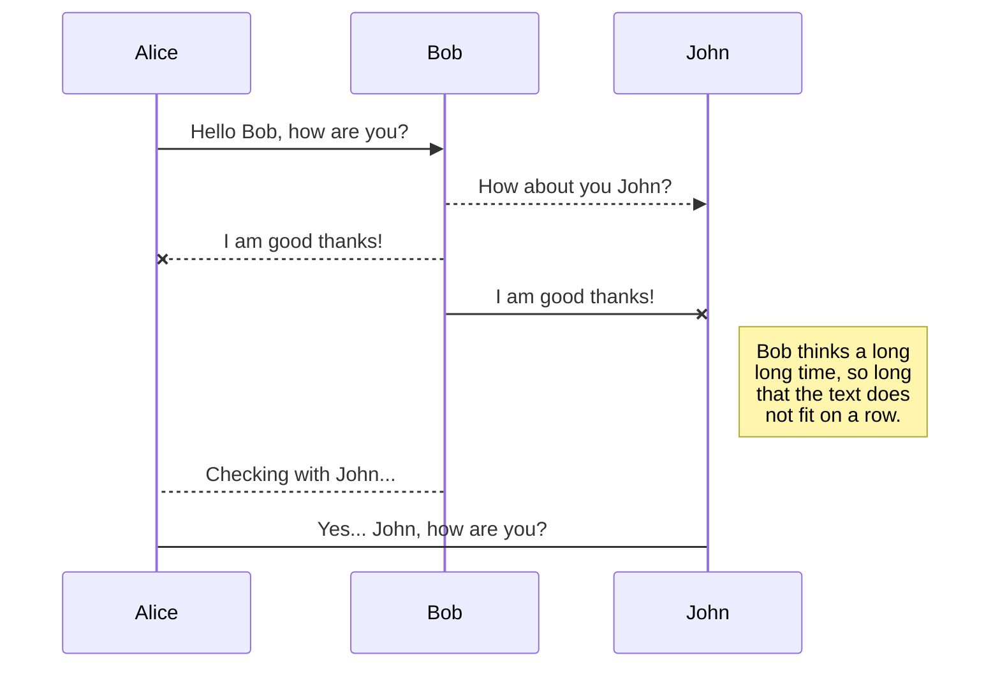
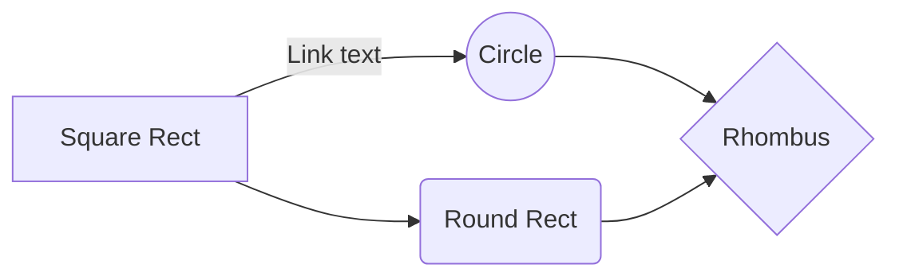

# Welcome to *React*

React is a **Open - Source Frontend JavaScript library**  which is used for building user interface especially for **Single Page Applications**.

1. It is used for web and mobile apps.
2. React was created by ***Jordan Walke***, a software engineer working
   for Facebook .
3. React was first deployed on Facebook's News feed in 2011 and on
   Instagram in 2012.

# Component

Specific part of code which we can use .

1. ***Why use Component* ?**
   →   Every React.js component acts separately, so you can change one section of the app without needing to update everything.
2. ***Types of Component* ?**
   → A **Class Component** must include the  `extends React.Component`  statement. This statement creates an inheritance to React.Component, and gives your component access to React. Component's functions.

The component also requires a  `render()`  method, this method returns HTML.

    class Car extends React.Component {
	  render() {
	    return`<h2>`Hi, I am a Car!`</h2>`;
	  }
	}
→  A **Function component** also returns HTML, and behaves much the same way as a Class component, but Function components can be written using much less code, are easier to understand, and will be preferred in this tutorial.

    function Car() {
	  return`<h2>`Hi, I am a Car!`</h2>`;
	}

## JSX

- It allows us to write *HTML* inside javascript and place them in the
  DOM without using functions like appendChild() or createElement().
- As started int the official docs of React,  **JSX** provides
  syntactic sugar for React.createElement () function.
- **JSX** makes it easier to write and add HTML in React.
  **With JSX :-**

  const myElement = `<h1>`I Love JSX!`</h1>`;

  const root = ReactDOM.createRoot(document.getElementById('root'));
  root.render(myElement);

**WITHOUT JSX :-**

    const myElement = React.createElement('h1', {}, 'I do not use JSX!');

    const root = ReactDOM.createRoot(document.getElementById('root'));
	root.render(myElement);

## Props

- Props are arguments passed into React components.
- Props are passed to components via HTML attributes.
- Props **allow us to pass data into the components**.

> `props`  stands for properties.

1. ***Why use props ?***
   The data can be passed from one component to another component using these props, similar to how the arguments are passed in a function.

## State

- The state is **a built-in React object that is used to contain data
  or information about the component**.
  State can only be used in class components

## Event Handling

- Just like HTML DOM events, React can perform actions based on user
  events.
- React has the same events as HTML: **click**, **change**,  **mouseover** etc.

## Adding Events

React events are written in camelCase syntax:

**`onClick`**  instead of  **`onclick`**.

React event handlers are written inside curly braces:

**`onClick={shoot}`** instead of  **`onClick="shoot()"`**.

### React:

```jsx
<button onClick={shoot}>Take the Shot!</button>
```

### HTML:

```html
<button onclick="shoot()">Take the Shot!</button>
```

### Example:

Put the  `shoot`  function inside the  `Football`  component:

```jsx
function Football() {
  const shoot = () => {
    alert("Great Shot!");
  }

  return (
    <button onClick={shoot}>Take the shot!</button>
  );
}

const root = ReactDOM.createRoot(document.getElementById('root'));
root.render(<Football />);
```

## Arrow Functions

An  **arrow function expression**  is a compact alternative to a traditional  function expression :-

- Arrow functions don't have their own bindings to  `this`,  `arguments`, or  `super`, and should not be used as  `methods`.
- Arrow functions cannot be used as constructors. Calling them with  `new`  throws a  `TypeError`They also don't have access to the  `new.target` keyword.
- Arrow functions cannot use  `yield`  within their body and cannot be created as generator functions.

### Before Arrow:

    hello = function() {
    return  "Hello World!";
    }

### After Arrow Function:

    hello = () => {
    return  "Hello World!";
    }

## What About  `this`?

The handling of  `this`  is also different in arrow functions compared to regular functions.

In short, with arrow functions there are no binding of  `this`.

In regular functions the  `this`  keyword represented the object that called the function, which could be the window, the document, a button or whatever.

With arrow functions the  `this`  keyword  _always_  represents the object that defined the arrow function.

# *Life - Cycle Methods*

In my words, life - cycle methods is like **A Person** :-

- Born
- Study
- Job
- Marriage
- Death

These methods one person will followed by same as in life cycle methods there are some life cycle methods in React Like:-

    1. Component banta hai
	 2. Update hota hai
	 3. Kuch data ko recieve krta hai
	 4. or phir vo unmount hota hai


#### Mounting

These methods are called in the following order when an instance of a component is being created and inserted into the DOM:

- **`constructor()`**
- **`static getDerivedStateFromProps()`**
- **`render()`**
- **`componentDidMount()`**

#### Updating

An update can be caused by changes to props or state. These methods are called in the following order when a component is being re-rendered:

- **`static getDerivedStateFromProps()`**
- **`shouldComponentUpdate()`**
- **`render()`**
- **`getSnapshotBeforeUpdate()`**
- **`componentDidUpdate()`**

#### Unmounting

This method is called when a component is being removed from the DOM:

- **`componentWillUnmount()`**

#### Error Handling

These methods are called when there is an error during rendering, in a lifecycle method, or in the constructor of any child component.

- **`static getDerivedStateFromError()`**
- **`componentDidCatch()`**

## Open a file

You can open a file from **Google Drive**, **Dropbox** or **GitHub** by opening the **Synchronize** sub-menu and clicking **Open from**. Once opened in the workspace, any modification in the file will be automatically synced.

## Save a file

You can save any file of the workspace to **Google Drive**, **Dropbox** or **GitHub** by opening the **Synchronize** sub-menu and clicking **Save on**. Even if a file in the workspace is already synced, you can save it to another location. StackEdit can sync one file with multiple locations and accounts.

## Synchronize a file

Once your file is linked to a synchronized location, StackEdit will periodically synchronize it by downloading/uploading any modification. A merge will be performed if necessary and conflicts will be resolved.

If you just have modified your file and you want to force syncing, click the **Synchronize now** button in the navigation bar.

> **Note:** The **Synchronize now** button is disabled if you have no file to synchronize.

## Manage file synchronization

Since one file can be synced with multiple locations, you can list and manage synchronized locations by clicking **File synchronization** in the **Synchronize** sub-menu. This allows you to list and remove synchronized locations that are linked to your file.

# Publication

Publishing in StackEdit makes it simple for you to publish online your files. Once you're happy with a file, you can publish it to different hosting platforms like **Blogger**, **Dropbox**, **Gist**, **GitHub**, **Google Drive**, **WordPress** and **Zendesk**. With [Handlebars templates](http://handlebarsjs.com/), you have full control over what you export.

> Before starting to publish, you must link an account in the **Publish** sub-menu.

## Publish a File

You can publish your file by opening the **Publish** sub-menu and by clicking **Publish to**. For some locations, you can choose between the following formats:

- Markdown: publish the Markdown text on a website that can interpret it (**GitHub** for instance),
- HTML: publish the file converted to HTML via a Handlebars template (on a blog for example).

## Update a publication

After publishing, StackEdit keeps your file linked to that publication which makes it easy for you to re-publish it. Once you have modified your file and you want to update your publication, click on the **Publish now** button in the navigation bar.

> **Note:** The **Publish now** button is disabled if your file has not been published yet.

## Manage file publication

Since one file can be published to multiple locations, you can list and manage publish locations by clicking **File publication** in the **Publish** sub-menu. This allows you to list and remove publication locations that are linked to your file.

# Markdown extensions

StackEdit extends the standard Markdown syntax by adding extra **Markdown extensions**, providing you with some nice features.

> **ProTip:** You can disable any **Markdown extension** in the **File properties** dialog.

## SmartyPants

SmartyPants converts ASCII punctuation characters into "smart" typographic punctuation HTML entities. For example:

|                  | ASCII                             | HTML                          |
| ---------------- | --------------------------------- | ----------------------------- |
| Single backticks | `'Isn't this fun?'`             | 'Isn't this fun?'             |
| Quotes           | `"Isn't this fun?"`             | "Isn't this fun?"             |
| Dashes           | `-- is en-dash, --- is em-dash` | -- is en-dash, --- is em-dash |

## KaTeX

You can render LaTeX mathematical expressions using [KaTeX](https://khan.github.io/KaTeX/):

The *Gamma function* satisfying $\Gamma(n) = (n-1)!\quad\forall n\in\mathbb N$ is via the Euler integral

$$
\Gamma(z) = \int_0^\infty t^{z-1}e^{-t}dt\,.
$$

> You can find more information about **LaTeX** mathematical expressions [here](http://meta.math.stackexchange.com/questions/5020/mathjax-basic-tutorial-and-quick-reference).

## UML diagrams

You can render UML diagrams using [Mermaid](https://mermaidjs.github.io/). For example, this will produce a sequence diagram:



And this will produce a flow chart:


